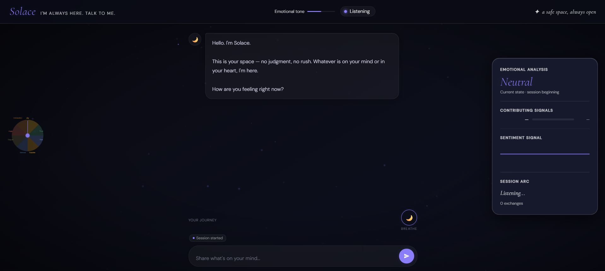

# Solace — AI-Powered Mental Health Companion


> Type how you feel. Solace listens, understands, and responds — with real-time emotion detection, adaptive background themes, and a live emotional analysis panel that tracks your session journey.

Built as part of an AI/ML portfolio — a production-level mental health companion combining LLM-based conversation, VADER sentiment analysis, multi-emotion scoring and a fully designed therapeutic UI.

---

## Screenshots

| Default — Session Start | Sadness Detected |
|---|---|
|  | .png) |

| Anxiety Detected | Anger Detected |
|---|---|
| .png) | .png) |

| Joy / Positive Detected | Crisis Mode |
|---|---|
| .png) | .png) |

---

## What It Does

- ✅ Real-time emotion detection — VADER sentiment + keyword scoring across 5 mood profiles
- ✅ Adaptive background themes — full-screen color shift per detected emotion (blue, crimson, gold, purple, red)
- ✅ Emotional Analysis Panel — live emotion bars, sentiment waveform, session arc tracking
- ✅ Session Intelligence Bar — exchange count, emotion journey, stress and energy indicators
- ✅ Crisis detection — 14 crisis keywords + VADER compound threshold → instant helpline response
- ✅ Typewriter text reveal — speed varies by detected emotion (slower for sadness, faster for anxiety)
- ✅ Breathing synchronization — full-screen 4-4-6-2 box breathing overlay
- ✅ Memory timeline — colored emotional journey dots at bottom of session
- ✅ Plutchik emotion wheel — live pointer tracks detected emotion
- ✅ Particle weather system — background particles match emotional state
- ✅ Dual LLM setup — Groq (Llama 3.1) primary with full Gemini fallback chain
- ✅ CBT and person-centred counselling principles baked into the system prompt

---

## How It Works

**Emotion Detection**
Every user message goes through two layers. VADER computes a compound sentiment score (−1 to +1) for intensity classification. A keyword scorer matches against 5 mood profiles — anxious, sad, angry, positive, neutral — with weighted keyword lists. The highest-scoring profile becomes the primary mood. Multi-emotion scoring then computes percentage contributions across all detected emotion signals.

**LLM Response Generation**
The detected mood, intensity, emotional arc and session history are injected into a structured system prompt based on CBT, mindfulness and person-centred counselling principles. Solace responds in 3-4 sentences maximum — acknowledge → reflect → explore. Response speed is intentional: sadness responses type slower, anxiety responses type faster.

**Crisis Handling**
14 hardcoded crisis keywords are checked before any LLM call. If triggered, or if VADER compound drops below −0.85, the response bypasses the LLM entirely and returns immediate helpline numbers — iCall, Vandrevala Foundation, AASRA and Befrienders International — with no API latency.

**Adaptive UI**
Every bot response triggers a smooth JS background interpolation — 60fps RAF loop blending current RGB values toward the target emotion color. No CSS transitions (which don't animate custom properties) — pure JS-driven gradient animation.

---

## Emotion → Theme Mapping

| Detected Mood | Background | Topbar |
|---|---|---|
| Sadness / Lonely | Deep Blue-Indigo | · Sadness |
| Anxious / Nervous | Purple-Violet | · Fear |
| Angry / Frustrated | Deep Red-Orange | · Anger |
| Happy / Positive | Warm Golden-Amber | · Joy |
| Excited | Bright Orange | · Anticipation |
| Hopeful / Grateful | Teal-Green | · Trust |
| Neutral | Dark Blue-Black | · Neutral |
| Crisis | Deep Crimson | · Crisis |

---

## Stack

| Layer | Technology |
|---|---|
| LLM (Primary) | Groq API — Llama 3.1 8B Instant |
| LLM (Fallback) | Google Gemini 1.5 Flash / 2.0 Flash |
| Sentiment | VADER (vaderSentiment) |
| Backend | Flask (Python 3.10) |
| Frontend | Vanilla JS + SVG + Canvas |
| Animations | RequestAnimationFrame (60fps) |
| Fonts | Cormorant Garamond + DM Sans |

---

## Running It

```bash
# Clone
git clone https://github.com/sagar4458/mental-health-companion.git
cd mental-health-companion

# Setup virtual environment
python -m venv venv
venv\Scripts\activate

# Install dependencies
pip install -r backend/requirements.txt

# Add API keys
# Create a .env file in the project root:
# GEMINI_API_KEY=your_gemini_key_here
# GROQ_API_KEY=your_groq_key_here

# Run
python backend/app.py
```

Open `http://localhost:5002`

---

## Getting API Keys (Both Free)

**Groq** (primary — 14,400 req/day free)
→ [console.groq.com](https://console.groq.com) → Sign up → API Keys → Create

**Google Gemini** (fallback — 1,500 req/day free)
→ [aistudio.google.com](https://aistudio.google.com) → Get API Key → Create

---

## Project Structure

```
mental_health_chatbot/
├── backend/
│   ├── app.py              # Flask backend — session management, API routes
│   ├── chatbot.py          # Emotion detection, LLM calls, crisis handling
│   └── requirements.txt
├── frontend/
│   └── index.html          # Full UI — emotion wheel, analysis panel, chat
├── screenshots/
├── .env                    # API keys — not committed
├── README.md
└── ROADMAP.md
```

---

## Emotion Profiles (chatbot.py)

```python
MOOD_PROFILES = {
    "anxious" : { tone: "calm, grounding and steady",      ... },
    "sad"     : { tone: "deeply warm, gentle, non-rushing", ... },
    "angry"   : { tone: "steady, non-judgmental",          ... },
    "positive": { tone: "warm, celebratory",               ... },
    "neutral" : { tone: "curious, gently exploratory",     ... },
}
```

Each profile has intensity modifiers (high / medium / low) and coping strategies injected into the Gemini/Groq prompt based on VADER intensity.

---

## Crisis Response

When crisis keywords are detected or VADER compound < −0.85, Solace immediately responds with:

```
iCall (India): 9152987821
Vandrevala Foundation: 1860-2662-345 — free, 24/7
AASRA: 9820466627 — 24/7
International: befrienders.org
```

No LLM call is made. Response is instant, deterministic and always present.

---

## Limitations

Mood detection relies on keyword matching — nuanced or indirect expressions ("I feel like a ghost") may not score correctly without the LLM's interpretation. VADER is trained on social media text and handles informal language well but can misclassify sarcasm. The system is not a replacement for professional mental health support and explicitly encourages users to seek professional help for persistent symptoms.

---

## Roadmap

See [ROADMAP.md](ROADMAP.md)

---

*Built: November 2025 — Production UI: June 2026*